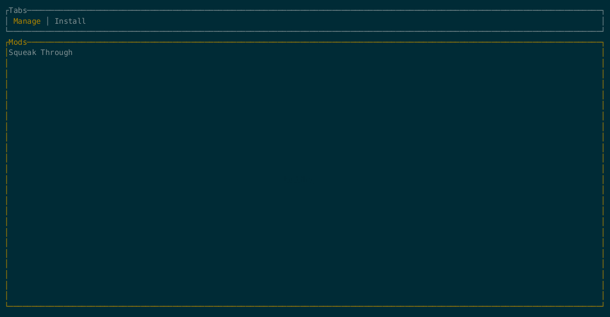

# FML

FML (Factorio Mod Loader) is a tui application to download and manage factorio mods on headless servers.

## Description

Mod management on headless factorio servers is rather painful because you always have to configure the mods you want to
have installed in factorio and then either copy all of the mods to the server or at least copy the mod-list.json file
and then use a script to download all mods specified in there.

FML aims to help here by being a tui application that can be installed on a headless server and can then be used to
configure mods without having to copy files between machines.

## Getting Started

### Keyboard Shortcuts

#### General

- `Up` -> Scroll up
- `Down` -> Scroll down
- `Tab` -> Change tabs
- `Ctrl + C` -> Quit FML

#### Manage Mods Tab

- `Enter` -> Enabled/Disable mod
- `d` -> Delete mod

#### Install Mods Tab

- `/` or start typing -> Switch to search bar
- `Esc` or `Down` -> Switch from search bar to mod list
- `Right` -> Switch from mod list to mod details
- `Left` -> Switch from mod details to mod list
- `Enter` -> Download mod

## Know Issues

#### Error Management

If something goes wrong, FML will crash. It won't exit gracefully or handle most errors.

#### Advanced Dependency Management

The current dependency management is very basic.
When downloading a mod with required dependencies FML will download the latest release of all required mod dependencies, but thats about it.
FML will not consider the factorio version or any constraints on the version of a dependency mod.

#### Importing a mod-list.json

FML is currently modelled similar to how the mod portal in factorio works.
This means the source of truth for installed mods are all mods that are installed in the mods directory.
The source of truth is **not** the mod-list.json file in the mods directory.
This file is only generated when exiting FML so the server knows which mods are enabled and which are not.
Therefore, it currently isn't possible to add a mod-list.json file in the mods directory and ask FML to download all mods from it.
